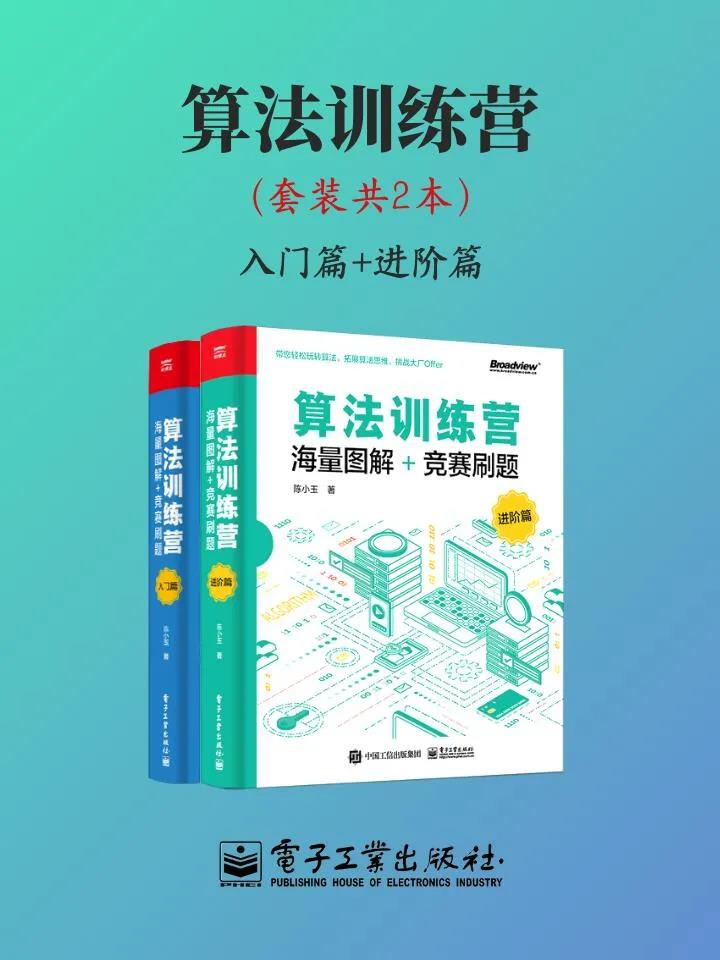

# 算法训练营（套装共2本）

1. **《算法训练营：海量图解+竞赛刷题（入门篇）》** 以海量图解的形式，详细讲解常用的数据结构与算法，又融入大量的竞赛实例和解题技巧。
   通过对本书的学习，读者可掌握12种初级数据结构、15种常用STL函数、10种二叉树和图的应用，以及8种搜索技术，并领悟不同的数据结构和算法的精髓，熟练应用各种算法解决实际问题。
   本书总计9章。
   * 第1章讲解C++语言基础，包括语法、函数、递归和数组；
   * 第2章讲解算法入门知识，包括算法复杂度计算、贪心算法、分治算法和STL应用；
   * 第3章讲解线性表的应用，包括顺序表、单链表、双向链表、循环链表和静态链表；
   * 第4章讲解栈和队列的应用，包括顺序栈、链栈、顺序队列和链队列；
   * 第5章讲解树的应用，包括树的存储、二叉树遍历与还原、哈夫曼编码；
   * 第6章讲解图论基础，包括图的存储、图的搜索和图的连通性；
   * 第7章讲解图的应用，包括最短路径、最小生成树、拓扑排序和关键路径；
   * 第8章讲解查找算法，包括哈希表、字符串模式匹配、二叉搜索树和平衡二叉树；
   * 第9章讲解搜索技术，包括二分搜索、深度优先搜索、广度优先搜索和启发式搜索。
2. **《算法训练营：海量图解+竞赛刷题（进阶篇）》** 以海量图解的形式，详细讲解常用的数据结构与算法，并结合竞赛实例引导读者进行刷题实战。
   通过对本书的学习，读者将掌握22种高级数据结构、7种动态规划算法、5种动态规划优化技巧，以及5种网络流算法，并熟练应用各种算法解决实际问题。
   本书总计8章。
    * 第1章讲解实用数据结构，包括并查集、优先队列；
   * 第2章讲解区间信息维护与查询，包括倍增、ST、RMQ、LCA、树状数组、线段树和分块；
   * 第3章讲解字符串处理，包括字典树、AC自动机和后缀数组；第4章讲解树上操作问题，包括点分治、边分治、树链剖分和动态树；
   * 第5章讲解各种平衡二叉树，包括Treap、伸展树和SBT；
   * 第6章讲解数据结构进阶，包括KD树、左偏树、跳跃表、树套树和可持久化数据结构；
   * 第7章讲解动态规划及其优化，包括背包问题、线性DP、区间DP、树形DP、数位DP、状态压缩DP、插头DP和动态规划优化方法；
   * 第8章讲解网络流问题，包括常用网络流算法、二分图最大匹配、最大流最小割定理和最小费用最大流。 
   
本书对每个算法都进行详细图解并搭配竞赛实例，重点讲解如何分析问题、优化算法，以期读者在短时间内掌握该算法并进行刷题实战。

